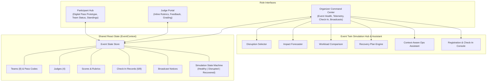
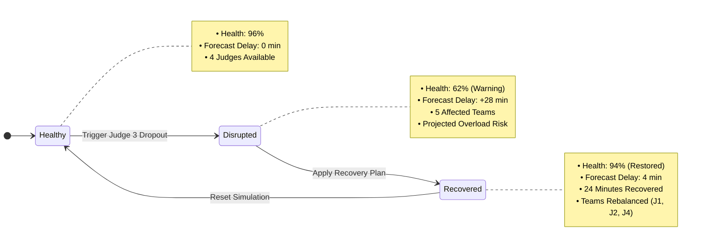

# Event Twin

> A smart event operations platform that simulates disruptions, predicts their impact, and recommends recovery plans before they derail the event.

---

## Live Demo

🌐 **Public Deployment**: [https://event-twin-hackathon-202-f5263.web.app](https://event-twin-hackathon-202-f5263.web.app)

---

## Chosen Vertical

**Smart Event Management**

Event Twin focuses on live event operations for hackathons and large technology events. It bridges the gap between static event dashboards and actionable contingency planning through a digital operational twin with disruption simulation, a context-aware operations assistant, and interactive pass check-in verification.

---

## Problem

Organizing large-scale technology events, conferences, and hackathons involves coordinating dozens of concurrent moving parts. Today, organizers rely on fragmented, disconnected tools for registration, judging queues, team assignments, announcements, and leaderboard tracking.

While traditional operations dashboards show **what is currently happening**, they are strictly reactive. When an operational problem occurs—such as a judge suddenly becoming unavailable or a schedule slipping—organizers are left to manually estimate the cascading delays and scramble to rebalance queues under time pressure.

---

## Solution

Event Twin unifies event operations into a single operational control plane and adds an **operational disruption simulation layer** paired with a **Context-Aware Ops Assistant** and **Interactive Pass Check-In Console**.

Instead of waiting for bottlenecks to derail the event, organizers can simulate operational disruptions in advance, forecast schedule delays, evaluate recovery recommendations, verify participant check-ins, and generate announcements with a single click.

---

## Approach and Logic

Event Twin uses a shared event state containing:
- **Judges** (availability, assigned queues, capacity)
- **Teams** (tracks, table assignments, evaluator links, check-in status, pass codes)
- **Assignments** (active mapping of teams to judges)
- **Scores** (multi-criteria rubric evaluations and feedback)
- **Announcements** (broadcast logs and notices)
- **Simulation State** (`healthy` | `disrupted` | `recovered`)

The MVP decision flow is:

$$\text{Simulate} \longrightarrow \text{Predict} \longrightarrow \text{Recommend} \longrightarrow \text{Recover}$$

For the current Judge 3 scenario:
1. **Simulate**: Trigger Judge 3 (Marcus Vance) as unavailable during judging.
2. **Predict**: Identify the 5 affected teams, calculate projected overload risk for remaining judges, and apply deterministic impact metrics (+28m delay, health drops from 96% to 62%).
3. **Recommend**: Present a predefined redistribution plan across available judges (Judge 1: +2 teams, Judge 2: +1 team, Judge 4: +2 teams).
4. **Recover**: Apply the plan, update team assignments, reduce forecasted delay to 4 minutes, record 24 minutes recovered, and restore health to 94%.

> **Prototype Logic**: Disruption impact forecasting, recovery recommendations, and Ops Assistant answers are powered by **deterministic, state-aware prototype logic** derived directly from shared `EventContext` data.

---

## How It Works

Event Twin operates through three interconnected role experiences powered by a shared in-memory state engine (`EventContext`):

- **Organizer Dashboard (Primary Cockpit)**: Contains the centerpiece **Event Twin Simulation Hub**, the **Context-Aware Ops Assistant**, the **Registration & Check-In Console**, health telemetry gauge, evaluator workload comparison, dynamic attendance metrics, and announcement broadcaster.
- **Judge Portal**: Provides assigned submission lists and direct in-card 4-factor rubric scoring with instant in-session updates to the shared leaderboard.
- **Participant Hub**: Provides a digital pass prototype with pass code verification, table assignment, assigned evaluator room details, broadcast notices, and in-session standings.

---

## Core Differentiator

Event Twin acts as a **digital operational twin** for live events—currently modeling judge availability, team assignments, queues, and schedule-delay impact.

### Demo Scenario: Evaluator Dropout During Project Judging

- **Initial Healthy Baseline**: 8 finalist teams assigned across 4 judges. Event health is **96%** with **0 minutes** predicted delay.
- **Disruption Injected**: Judge 3 becomes unavailable with 5 teams in his queue.
- **Impact Predicted**: Event Twin flags **5 affected teams**, forecasts a **28-minute schedule delay**, shows projected overload risk for remaining judges, and drops event health to **62%**.
- **Recovery Plan Recommended**: Event Twin presents a predefined recovery recommendation redistributing affected teams across available judges.
- **Plan Applied**: The organizer applies the recovery plan. Predicted delay drops to **4 minutes**, **24 minutes are recovered**, judge workloads update, and event health rises to **94%**.

---

## Interactive Check-In & Digital Pass Prototype

Event Twin features a frontend **QR & Pass Verification Console** connecting organizer attendance operations with participant passes:

- **Shared Attendance State**: 8 demo finalist teams each receive a unique registration pass code (`TEAM-001` through `TEAM-008`).
- **Real-Time Validation**: Organizers can enter or quick-fill demo pass codes (e.g. `TEAM-007` for *ShieldOps*).
- **Duplicate & Invalid Pass Protection**: Validates against already checked-in codes and non-existent passes with instant feedback.
- **Live Metrics Synchronization**: Dynamic check-in counter and attendance percentage update instantly across all views.
- **State Persistence**: Team check-in statuses are preserved across Event Twin simulation resets.

---

## Event Twin Ops Assistant

The **Context-Aware Ops Assistant** provides situational analysis and communication drafting based directly on current event state:

1. **"What is the biggest risk?"**: Analyzes current operational exposures (e.g. queue concentration in Healthy state, stranded teams and cutoff risks in Disrupted state, or residual delay in Recovered state).
2. **"Why this recovery plan?"**: Explains the rationale behind queue redistribution and quantifies recovered time.
3. **"Draft participant update"**: Generates state-specific announcement copy with a **"Post Announcement"** action allowing organizers to explicitly publish the notice to the live feed.

> **Architecture Note**: The assistant operates on deterministic, state-aware logic derived from client-side `EventContext` variables (`eventHealth`, `judges`, `teams`, `simulationState`). No external backend or production LLM is connected.

---

## User Roles

### 1. Organizer (Primary Experience)
- **Event Health** monitoring and dynamic delay forecasting.
- **Event Twin Simulation Hub**: Disruption injection, downstream impact preview, judge workload comparison, and recovery plan application.
- **Context-Aware Ops Assistant**: State-driven risk analysis, recovery rationale, and 1-click participant announcement drafting.
- **Registration & Check-In Console**: Pass code validation, live attendance count, and team check-in status.
- **Judge Status**: Evaluator availability and queue workload overview.
- **Announcements**: In-session broadcast publishing.
- **Leaderboard**: Aggregated finalist standings.

### 2. Judge
- Assigned finalist submissions.
- Direct in-card 4-factor rubric scoring (**Innovation**, **Technical Execution**, **Product Polish**, **Practical Impact** on a 1–10 scale).
- Qualitative feedback input with instant in-session score updates.

### 3. Participant
- Digital pass prototype with registration pass code and check-in status badge.
- Team table assignment, track badge, and assigned evaluator details.
- Broadcast notices.
- In-session leaderboard with team rank highlight.

---

## Demo Flow

1. Open the **Organizer View** to observe the healthy event baseline (96% health, 0m delay, 6/8 check-in baseline).
2. Use the **Check-In Console** to check in Team 7 (*ShieldOps*) using demo pass `TEAM-007`. Observe attendance increase to 7/8 (88%).
3. Switch to the **Participant Hub** (*ShieldOps*) to verify the digital pass updates from *Not Checked In* to *Checked In*.
4. Return to the **Organizer View** and query the **Ops Assistant** (*"What is the biggest risk?"*) to inspect queue concentration.
5. Click **Trigger Judge 3 Dropout (Simulate)** in the Event Twin simulation hub.
6. Review the **Impact Forecast** (5 affected teams, +28m delay, projected overload risk for remaining judges, health drops to 62%).
7. Query the **Ops Assistant** (*"Draft participant update"*) and click **Post Announcement** to broadcast an operational adjustment notice to all teams.
8. Click **Apply Recovery Plan** to apply the predefined redistribution across Judges 1, 2, and 4.
9. Observe the updated metrics: delay reduced to **4 minutes**, **24 minutes recovered**, and health restored to **94%**.
10. Switch to the **Judge Portal** (e.g. Dr. Sarah Chen) to review rebalanced submissions and score a project using the inline rubric.
11. Click **Reset** in the Organizer View to return the simulation state to baseline while preserving check-in states, recorded scores, and manual announcements.

---

## Architecture

Event Twin is built as a single-page application using shared React Context to provide instant in-session state synchronization across all roles.

---

## Simulation State Model

---

## Assumptions

- **Single Event Prototype**: The application models a single active hackathon event session.
- **8 Finalist Teams & 4 Judges**: Configured with 8 finalist teams across 2 tracks (`AI Agents`, `Developer Tools`) and 4 domain evaluators.
- **Primary Disruption Scenario**: Judge 3 (Marcus Vance) unavailability with 5 queued teams represents the primary simulated operational disruption.
- **Deterministic Metrics**: Health scores (96% $\rightarrow$ 62% $\rightarrow$ 94%) and delay forecasts (0m $\rightarrow$ 28m $\rightarrow$ 4m) are deterministic demo values.
- **Predefined Recovery Assignments**: Recovery reallocations are predefined for the demonstration.
- **In-Memory Single-Session State**: Application state operates in-memory within the client session via React Context.
- **Prototype Boundaries**: No production authentication, backend, optimization solver, or multi-client synchronization is implemented.

---

## Testing

Event Twin includes automated unit testing powered by Vitest to validate the simulation engine, Ops Assistant, check-in operations, and state persistence:

- **Test Suite**: Run `npm test`
- **Simulation Coverage**:
  - `Healthy -> Disrupted -> Recovered -> Reset` full state lifecycle
  - `96% / 0 min` baseline health and delay validation
  - `62% / 28 min / 5 affected teams` disruption impact verification
  - `94% / 4 min / 24 min recovered` recovery execution verification
  - Baseline assignment restoration upon reset
  - Evaluator scores, check-in records, and manual announcements **strictly preserved** after simulation reset
  - **Ops Assistant Component Lifecycle**: Verifies dynamic metric binding across Healthy, Disrupted, and Recovered states
  - **Interactive Check-In Verification**: Valid pass check-in, duplicate prevention, and invalid pass handling
  - **Announcement Publishing**: Verifies that Ops Assistant announcement drafts post successfully to shared state
- **Build Verification**: Run `npm run build` (passes with 0 TypeScript/Vite errors)

---

## Tech Stack

- **React 18**: Component-driven UI architecture
- **TypeScript**: Strict type definitions for domain entities and simulation state
- **Vite**: Build tooling and development environment
- **Tailwind CSS**: Dark-slate operational dashboard interface
- **Lucide React**: Iconography
- **React Context**: In-memory shared state engine for reactive in-session updates
- **Vitest**: Unit testing suite for simulation transitions, assistant state, and check-in
- **Firebase Hosting**: Production single-page application hosting

---

## Current Scope

This repository contains a **frontend prototype MVP** built for a time-limited hackathon demonstration.

The current implementation includes:
- **No authentication layer** (role switching is available for demo convenience).
- **No production backend or persistent database** (state lives in memory within the client session).
- **No real-time optimization solver** (recovery recommendations are deterministic and predefined for the demo scenario).
- **No hardware QR scanning or camera access** (the check-in workflow uses frontend pass code validation and digital pass display).
- **No production LLM API** (the Ops Assistant uses deterministic, state-derived analysis).

---

## Future Vision

- **Multiple Disruption Scenarios**: Simulating Wi-Fi degradation, room AV issues, catering delays, and presentation time overruns.
- **Automatic Disruption Detection & Live Event Telemetry**: Connecting live check-in and floor sensor data to identify operational bottlenecks automatically.
- **Real-Time Backend Synchronization**: Multi-client data synchronization via WebSockets or Supabase Realtime for concurrent organizers, evaluators, and participants across separate devices.
- **Algorithmic Rebalancing**: Applying assignment and optimization techniques such as the Hungarian algorithm or integer programming to match teams to evaluators by domain specialty and availability constraints.
- **Physical QR Scanner Integration**: Native mobile and camera QR verification with cryptographic badge signing.
- **AI-Assisted Recovery Recommendations**: Generating context-aware recovery plans and operational announcements based on schedule drift.

---

## Development Approach

Event Twin was designed, architected, and built with **Google Antigravity**:
- **Planning & Scoping**: Streamlining operational requirements for a crisp, high-impact hackathon presentation.
- **Architecture**: Structuring reactive state to enable instant in-session synchronization across roles without backend overhead.
- **Implementation**: Rapid scaffolding of TypeScript interfaces, Tailwind styling, and responsive role views.
- **Verification & Debugging**: Validating state transitions (`Healthy -> Disrupted -> Recovered -> Reset`), type safety, and headless browser testing.
- **Iterative Refinement**: Isolating simulation resets from user-entered evaluation scores, check-in data, and manual broadcasts.
