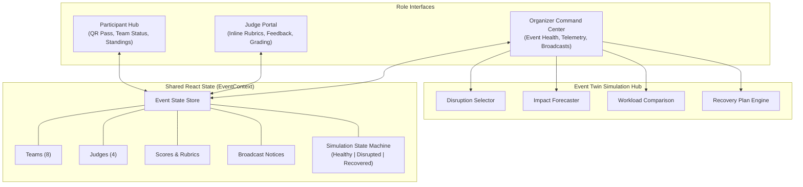
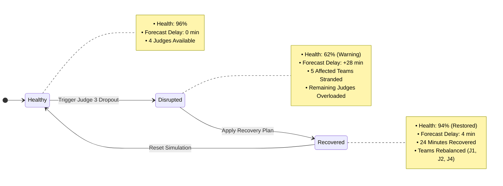

# Event Twin

> A smart event operations platform that simulates disruptions, predicts their impact, and recommends recovery plans before they derail the event.

---

## Problem

Organizing large-scale technology events, conferences, and hackathons involves coordinating dozens of concurrent moving parts. Today, organizers rely on fragmented, disconnected tools for registration, judging queues, team assignments, announcements, and leaderboard tracking.

While modern operations dashboards show **what is currently happening**, they are strictly reactive. When an operational failure occurs—such as a judge suddenly dropping out or a room schedule slipping—organizers are left to manually estimate the cascading delays and scramble to rebalance queues under time pressure.

---

## Solution

Event Twin unifies event operations into a single operational control plane and adds an **operational disruption simulation layer**. 

The core operating model follows a five-stage loop:

$$\text{Detect} \longrightarrow \text{Simulate} \longrightarrow \text{Predict} \longrightarrow \text{Recommend} \longrightarrow \text{Recover}$$

Instead of waiting for bottlenecks to break the event schedule, organizers can proactively stress-test operational disruptions, forecast schedule delays in minutes, and execute automated recovery plans in one click.

---

## Core Differentiator

Event Twin acts as a **digital operational twin** for live events—modeling evaluators, team queues, room capacities, and schedule milestones.

### Demo Scenario: Evaluator Dropout During Project Judging

1. **Initial Healthy Baseline**: 8 finalist teams assigned across 4 judges. Event health is **96%** with **0 minutes** predicted delay.
2. **Disruption Injected**: Judge 3 (Marcus Vance) becomes unavailable with 5 teams in his queue.
3. **Impact Predicted**: Event Twin flags **5 stranded teams**, forecasts a **28-minute schedule delay** (threatening the awards ceremony), overloads remaining judges, and drops overall event health to **62%**.
4. **Recovery Plan Generated**: Event Twin calculates an optimal redistribution across available judges (Judge 1: +2 teams, Judge 2: +1 team, Judge 4: +2 teams).
5. **Plan Applied**: The organizer applies the recovery plan. Predicted delay drops from 28 minutes to **4 minutes**, **24 minutes are recovered**, judge workloads rebalance, and event health recovers to **94%**.

> **Note**: The current MVP utilizes deterministic frontend simulation data to demonstrate this operational twin concept in a fast, reliable hackathon environment.

---

## User Roles

### 1. Organizer (Primary Experience)
- Real-time **Event Health** telemetry gauge and delay forecasting.
- **Event Twin Simulation Hub**: Disruption injection, downstream impact preview, judge workload comparison, and recovery plan execution.
- **Judge Matrix**: Live room assignments, evaluator statuses, and queue capacities.
- **Broadcast Manager**: Instant announcement publishing.
- **Live Leaderboard**: Real-time aggregated finalist rankings.

### 2. Judge
- Assigned finalist queue with direct room and table routing.
- Direct in-card 4-factor rubric scoring (**Innovation**, **Technical Execution**, **Product Polish**, **Practical Impact** on a 1–10 scale).
- Qualitative feedback input with instant submission to shared state.

### 3. Participant
- Digital event pass with verification status and SVG QR code.
- Team table assignment, track badge, and assigned evaluator room.
- Live event broadcast alerts.
- Live public leaderboard with team rank highlight.

---

## Demo Flow

1. Open the **Organizer View** to observe the healthy event baseline (96% health, 0m delay).
2. Click **Trigger Judge 3 Dropout (Simulate)** in the Event Twin simulation hub.
3. Review the **Real-Time Impact Forecast** (5 stranded teams, +28m delay, remaining judges overloaded, health drops to 62%).
4. Click **Apply Recovery Plan** to rebalance the 5 teams across Judges 1, 2, and 4.
5. Observe the updated metrics: delay reduced to **4 minutes**, **24 minutes recovered**, and health restored to **94%**.
6. Switch to the **Judge Portal** (e.g. Dr. Sarah Chen) to review rebalanced submissions and score a project using the inline rubric.
7. Switch to the **Participant Hub** to verify that team assignments, broadcast notices, and leaderboard standings synchronized instantly.
8. Click **Reset** in the Organizer View to return the simulation state to baseline while preserving recorded scores and manual announcements.

---

## Architecture

Event Twin is built as a reactive single-page application using shared React Context to synchronize state across all roles without page refreshes.

---

## Simulation State Model

---

## Tech Stack

- **React 18**: Component-driven UI architecture
- **TypeScript**: Strict type definitions for domain entities and simulation state
- **Vite**: Build tooling and rapid development server
- **Tailwind CSS**: High-density, dark-slate operational dashboard interface
- **Lucide React**: Operational iconography
- **React Context**: Reactive in-memory shared state engine

---

## Current Scope

This repository contains a **frontend prototype MVP** built for a time-limited hackathon demonstration.

The current implementation includes:
- **No authentication layer** (role switching is instantaneous for demo convenience).
- **No production backend or persistent database** (state lives in memory within the client session).
- **No real-time optimization solver** (recovery plans use deterministic heuristics tailored to the demonstration scenario).

---

## Future Vision

- **Multi-Scenario Disruption Engine**: Simulating Wi-Fi access point degradation, room AV failures, catering delays, and presentation time overruns.
- **Real-Time Backend Synchronization**: Multi-client sync via WebSockets / Supabase Realtime for concurrent organizers, evaluators, and participants.
- **Constraint-Based Optimization Solver**: Linear programming (e.g. Hungarian algorithm / integer programming) to match reallocated teams to evaluators by domain expertise, language, and conflict-of-interest rules.
- **Physical Room & Floor IoT Telemetry**: Integrating live floor sensor feeds and check-in scanner telemetry to detect physical bottlenecks automatically.
- **AI-Assisted Operational Copilot**: Natural language incident response and automated broadcast generation based on live schedule drift.

---

## Development Approach

Event Twin was designed, architected, and built with **Google Antigravity**:
- **Planning & Scoping**: Streamlining operational requirements for a crisp, high-impact hackathon presentation.
- **Architecture**: Structuring reactive state to enable cross-role synchronization without backend overhead.
- **Implementation**: Rapid scaffolding of TypeScript interfaces, Tailwind styling, and responsive role views.
- **Verification & Debugging**: Validating state transitions (`Healthy -> Disrupted -> Recovered -> Reset`), type safety, and bundle optimization.
- **Iterative Refinement**: Isolating simulation resets from user-entered evaluation scores and manual broadcasts.
