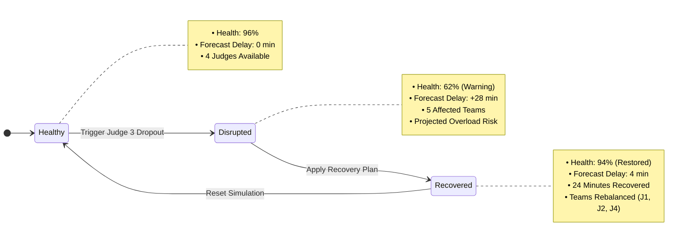

# Event Twin

> A smart event operations platform that simulates disruptions, predicts their impact, and recommends recovery plans before they derail the event.

---

## Chosen Vertical

**Smart Event Management & Live Operations**

Event Twin directly addresses live operations for hackathons, technology conferences, and demo days. It bridges the gap between static operations dashboards and actionable contingency planning by introducing an operational digital twin with disruption simulation.

---

## Problem

Organizing large-scale technology events, conferences, and hackathons involves coordinating dozens of concurrent moving parts. Today, organizers rely on fragmented, disconnected tools for registration, judging queues, team assignments, announcements, and leaderboard tracking.

While traditional operations dashboards show **what is currently happening**, they are strictly reactive. When an operational problem occurs—such as a judge suddenly becoming unavailable or a schedule slipping—organizers are left to manually estimate the cascading delays and scramble to rebalance queues under time pressure.

---

## Solution

Event Twin unifies event operations into a single operational control plane and adds an **operational disruption simulation layer**.

Instead of waiting for bottlenecks to derail the event, organizers can simulate operational disruptions in advance, forecast schedule delays, and apply predefined recovery recommendations with a single click.

---

## Approach and Logic

The current MVP demonstrates a four-stage decision and simulation loop:

$$\text{Simulate} \longrightarrow \text{Predict} \longrightarrow \text{Recommend} \longrightarrow \text{Recover}$$

1. **Simulate**: The organizer injects an operational disruption scenario (e.g. an evaluator suddenly becoming unavailable).
2. **Predict**: The system forecasts downstream schedule impact, delays, and evaluator queue bottlenecks.
3. **Recommend**: The system presents a recovery plan to rebalance affected teams across available evaluators.
4. **Recover**: The organizer executes the recovery recommendation, immediately updating team assignments, reducing forecasted delay, and restoring event health.

> **Prototype Logic**: For this hackathon prototype, disruption impact forecasting, schedule-delay calculations, and recovery recommendations are powered by **deterministic frontend simulation logic** designed to clearly demonstrate the digital operational twin concept.

---

## How It Works

Event Twin operates through three interconnected role experiences powered by a shared in-memory state engine (`EventContext`):

- **Organizer Dashboard (Primary Cockpit)**: Contains the centerpiece **Event Twin Simulation Hub**, real-time health telemetry gauge, evaluator workload comparison, attendance metrics, and announcement broadcaster.
- **Judge Portal**: Provides assigned submission lists and direct in-card 4-factor rubric scoring with instant in-session updates to the shared leaderboard.
- **Participant Hub**: Provides a static QR-style digital pass prototype, table assignment, assigned evaluator room details, live broadcast notices, and public standings.

---

## Core Differentiator

Event Twin acts as a **digital operational twin** for live events—currently modeling judge availability, team assignments, queues, and schedule-delay impact.

### Demo Scenario: Evaluator Dropout During Project Judging

1. **Initial Healthy Baseline**: 8 finalist teams assigned across 4 judges. Event health is **96%** with **0 minutes** predicted delay.
2. **Disruption Injected**: Judge 3 (Marcus Vance) becomes unavailable with 5 teams in his queue.
3. **Impact Predicted**: Event Twin flags **5 affected teams**, forecasts a **28-minute schedule delay** (threatening leaderboard finalization), shows projected overload risk for remaining judges, and drops overall event health to **62%**.
4. **Recovery Plan Generated**: Event Twin presents a predefined recovery recommendation redistributing affected teams across available judges (Judge 1: +2 teams, Judge 2: +1 team, Judge 4: +2 teams).
5. **Plan Applied**: The organizer applies the recovery plan. Predicted delay drops from 28 minutes to **4 minutes**, **24 minutes are recovered**, judge workloads update, and event health rises to **94%**.

---

## User Roles

### 1. Organizer (Primary Experience)
- Real-time **Event Health** monitoring and delay forecasting.
- **Event Twin Simulation Hub**: Disruption injection, downstream impact preview, judge workload comparison, and recovery plan application.
- **Judge Status**: Evaluator availability and queue workload overview.
- **Announcements**: In-session broadcast publishing.
- **Leaderboard**: Aggregated finalist standings.

### 2. Judge
- Assigned finalist submissions.
- Direct in-card 4-factor rubric scoring (**Innovation**, **Technical Execution**, **Product Polish**, **Practical Impact** on a 1–10 scale).
- Qualitative feedback input with instant in-session score updates.

### 3. Participant
- Static QR-style digital pass prototype.
- Team table assignment, track badge, and assigned evaluator details.
- Live broadcast notices.
- Live public leaderboard with team rank highlight.

---

## Demo Flow

1. Open the **Organizer View** to observe the healthy event baseline (96% health, 0m delay).
2. Click **Trigger Judge 3 Dropout (Simulate)** in the Event Twin simulation hub.
3. Review the **Real-Time Impact Forecast** (5 affected teams, +28m delay, projected overload risk for remaining judges, health drops to 62%).
4. Click **Apply Recovery Plan** to apply the predefined redistribution across Judges 1, 2, and 4.
5. Observe the updated metrics: delay reduced to **4 minutes**, **24 minutes recovered**, and health restored to **94%**.
6. Switch to the **Judge Portal** (e.g. Dr. Sarah Chen) to review rebalanced submissions and score a project using the inline rubric.
7. Switch to the **Participant Hub** to verify that team assignments, broadcast notices, and leaderboard standings reflect instant frontend synchronization.
8. Click **Reset** in the Organizer View to return the simulation state to baseline while preserving recorded scores and manual announcements.

---

## Architecture

Event Twin is built as a single-page application using shared React Context to provide instant in-session state synchronization across all roles.

---

## Simulation State Model

---

## Assumptions

- **Single-Event Scope**: The application models a single active hackathon event session.
- **Demo Scale**: Configured with 8 finalist teams across 2 tracks (`AI Agents`, `Developer Tools`) and 4 domain evaluators.
- **Primary Disruption Scenario**: Judge 3 (Marcus Vance) dropout with 5 queued teams represents the primary simulated operational failure.
- **Deterministic Metrics**: Forecasted delay minutes (0m -> 28m -> 4m), recovered time (24m), and event health scores (96% -> 62% -> 94%) are deterministic demo values.
- **In-Memory State**: State management is single-session and in-memory via React Context without external persistence.
- **No Production Optimization Solver**: Rebalancing recommendations are predefined for the prototype; no live linear programming solver or multi-user backend is currently connected.

---

## Tech Stack

- **React 18**: Component-driven UI architecture
- **TypeScript**: Strict type definitions for domain entities and simulation state
- **Vite**: Build tooling and development environment
- **Tailwind CSS**: Dark-slate operational dashboard interface
- **Lucide React**: Iconography
- **React Context**: In-memory shared state engine for reactive in-session updates

---

## Current Scope

This repository contains a **frontend prototype MVP** built for a time-limited hackathon demonstration.

The current implementation includes:
- **No authentication layer** (role switching is available for demo convenience).
- **No production backend or persistent database** (state lives in memory within the client session).
- **No real-time optimization solver** (recovery recommendations are deterministic and predefined for the demo scenario).
- **No hardware QR scanning or real verification** (the participant pass is a static visual prototype).

---

## Future Vision

- **Multiple Disruption Scenarios**: Simulating Wi-Fi degradation, room AV issues, catering delays, and presentation time overruns.
- **Automatic Disruption Detection & Live Event Telemetry**: Connecting live check-in and floor sensor data to identify operational bottlenecks automatically.
- **Real-Time Backend Synchronization**: Multi-client data synchronization via WebSockets or Supabase Realtime for concurrent organizers, evaluators, and participants.
- **Algorithmic Rebalancing**: Applying assignment and optimization techniques such as the Hungarian algorithm or integer programming to match teams to evaluators by domain specialty and availability constraints.
- **Room and Schedule Disruption Handling**: Dynamic rescheduling across physical rooms and stage presentation blocks.
- **AI-Assisted Recovery Recommendations**: Generating context-aware recovery plans and operational announcements based on schedule drift.

---

## Development Approach

Event Twin was designed, architected, and built with **Google Antigravity**:
- **Planning & Scoping**: Streamlining operational requirements for a crisp, high-impact hackathon presentation.
- **Architecture**: Structuring reactive state to enable instant in-session synchronization across roles without backend overhead.
- **Implementation**: Rapid scaffolding of TypeScript interfaces, Tailwind styling, and responsive role views.
- **Verification & Debugging**: Validating state transitions (`Healthy -> Disrupted -> Recovered -> Reset`), type safety, and headless browser testing.
- **Iterative Refinement**: Isolating simulation resets from user-entered evaluation scores and manual broadcasts.
